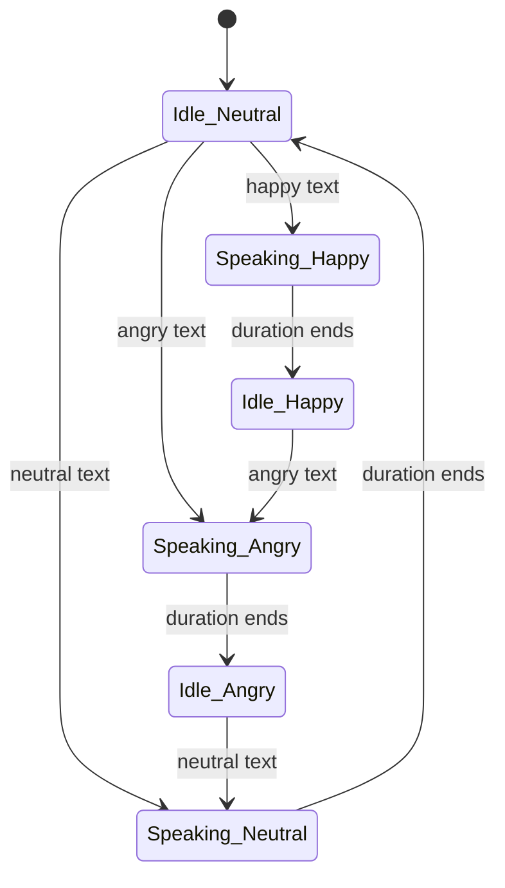

# Technical Architecture Documentation

## System Overview

### Purpose
Text-driven 2D avatar system for chatbot interfaces. Provides visual feedback through facial expressions and mouth animation without requiring audio input or phoneme analysis.

### Scope
**Prototype-level** implementation for technical research and feasibility demonstration. Not production-ready.

## Architecture Diagram

```
┌─────────────────────────────────────────────────────────┐
│                     User Interface                       │
│  ┌─────────────────┐         ┌──────────────────────┐   │
│  │  Avatar Display │         │  Chat Interface      │   │
│  │  (Visual Output)│         │  (Text Input/Output) │   │
│  └────────┬────────┘         └──────────┬───────────┘   │
│           │                             │               │
└───────────┼─────────────────────────────┼───────────────┘
            │                             │
            │                             ▼
            │                   ┌──────────────────┐
            │                   │ ChatInterface.tsx│
            │                   │ - Message state  │
            │                   │ - Mock responses │
            │                   └────────┬─────────┘
            │                            │
            │                            ▼
            │                   ┌──────────────────────┐
            │                   │ expressionDetector.ts│
            │                   │ - Emotion analysis   │
            │                   │ - Duration calc      │
            │                   └────────┬─────────────┘
            │                            │
            ▼                            ▼
    ┌───────────────────────────────────────┐
    │         State Management              │
    │  - expression: Expression             │
    │  - isSpeaking: boolean                │
    │  - mouthOpen: boolean                 │
    └───────────┬───────────────────────────┘
                │
                ▼
        ┌───────────────┐
        │  Avatar.tsx   │
        │  - Layer mgmt │
        │  - Animations │
        └───────────────┘
```

## Component Architecture

### 1. Avatar Component

**Responsibility**: Visual rendering of avatar with layered assets

**Props**:
```typescript
interface AvatarProps {
  expression: Expression;  // 'neutral' | 'happy' | 'angry'
  isSpeaking: boolean;     // Currently animating speech
  mouthOpen: boolean;      // Mouth state (toggles)
}
```

**Layer Stack** (bottom to top):
```
Layer 4: Speaking Indicator (conditional)
Layer 3: Mouth Open (conditional, while speaking)
Layer 2: Expression (crossfades)
Layer 1: Base Head (static)
```

**Animation Types**:
- **Crossfade**: Between expressions (300ms)
- **Toggle**: Mouth open/close (100ms)
- **Pulse**: Speaking indicator dots (1000ms loop)

### 2. ChatInterface Component

**Responsibility**: Conversation management and speaking orchestration

**Props**:
```typescript
interface ChatInterfaceProps {
  onExpressionChange: (expression: Expression) => void;
  onSpeakingChange: (speaking: boolean) => void;
  onMouthToggle: (open: boolean) => void;
}
```

**State**:
```typescript
const [messages, setMessages] = useState<Message[]>([]);
const [input, setInput] = useState('');
const [isProcessing, setIsProcessing] = useState(false);
```

**Flow**:
1. User sends message → Added to messages array
2. Mock response generated → Detect expression
3. Calculate speaking duration from text length
4. Trigger speaking animation → Callback to parent
5. Toggle mouth at 200ms intervals → Callback to parent
6. After duration → Stop speaking, keep expression

### 3. Expression Detector (Utility)

**Responsibility**: Text analysis and timing calculation

**Functions**:

```typescript
// Emotion detection from text
detectExpression(text: string): Expression

// Speaking duration estimation
estimateSpeakingDuration(text: string): number
```

**Detection Logic**:
```
Score-based keyword matching:
- Happy keywords: +1 per match
- Angry keywords: +1 per match
- Highest score wins
- Ties → neutral
```

**Duration Formula**:
```
words = text.split(/\s+/).length
duration = (words / 2.5) * 1000  // ~150 wpm
clamped to [1000ms, 10000ms]
```

## State Flow

### Speaking Cycle

```
[IDLE, NEUTRAL]
      │
      ▼ User sends message
[PROCESSING]
      │
      ▼ Response generated
[EXPRESSION DETECTED]
      │
      ▼ Duration calculated
[SPEAKING START]
      │
      ├─ isSpeaking = true
      ├─ expression = detected
      │
      ▼ Every 200ms
[MOUTH TOGGLE LOOP]
      │
      ├─ mouthOpen = !mouthOpen
      │
      ▼ After duration
[SPEAKING END]
      │
      ├─ isSpeaking = false
      ├─ mouthOpen = false
      └─ expression persists
      │
      ▼
[IDLE, EXPRESSION]
```

### State Transitions



## Asset Management

### File Structure
```
public/assets/
├── Untitled_design__35_.png  # Base head (always visible)
├── 2.png                      # Neutral expression
├── 3.png                      # Happy expression
├── 4.png                      # Angry expression
└── 9.png                      # Mouth open (overlay)
```

### Asset Requirements
- **Format**: PNG with transparency
- **Size**: Consistent dimensions (recommend 512x512)
- **Layering**: Aligned for perfect overlay
- **Transparency**: Critical for layer compositing

### Expression Mapping
```typescript
const expressionAssets = {
  neutral: '/assets/2.png',
  happy: '/assets/3.png',
  angry: '/assets/4.png',
};
```

## Animation System

### Framer Motion Configuration

**Expression Crossfade**:
```typescript
<motion.div
  key={expression}
  initial={{ opacity: 0 }}
  animate={{ opacity: 1 }}
  exit={{ opacity: 0 }}
  transition={{ duration: 0.3 }}
>
```

**Mouth Toggle**:
```typescript
<motion.div
  animate={{ opacity: mouthOpen ? 1 : 0 }}
  transition={{ duration: 0.1 }}
>
```

**Speaking Indicator**:
```typescript
<motion.div
  animate={{
    scale: [1, 1.5, 1],
    opacity: [0.5, 1, 0.5]
  }}
  transition={{
    duration: 1,
    repeat: Infinity,
    delay: index * 0.2
  }}
>
```

## Performance Considerations

### Optimizations Applied
- ✅ AnimatePresence `mode="wait"` (prevents multiple overlays)
- ✅ Image preloading via Next.js automatic optimization
- ✅ Minimal re-renders (props don't change unless necessary)
- ✅ requestAnimationFrame for smooth animations

### Bottlenecks to Monitor
- Multiple rapid expression changes (< 300ms apart)
- Large asset file sizes (> 500KB)
- Long speaking durations (> 10s)

## Extension Points

### Adding New Expressions

1. **Add asset** to `/public/assets/`
2. **Update type**: `type Expression = 'neutral' | 'happy' | 'angry' | 'sad'`
3. **Update mapping**:
   ```typescript
   const expressionAssets = {
     // ...existing
     sad: '/assets/sad.png',
   };
   ```
4. **Update detector**:
   ```typescript
   const sadWords = ['sad', 'cry', 'disappointed'];
   ```

### Integrating Real Chatbot

Replace mock responses in `ChatInterface.tsx`:

```typescript
const getRealResponse = async (userInput: string) => {
  const response = await fetch('/api/chat', {
    method: 'POST',
    body: JSON.stringify({ message: userInput })
  });
  
  const data = await response.json();
  return {
    response: data.message,
    expression: detectExpression(data.message)
  };
};
```

### Adding Phoneme-Based Lip Sync

1. Integrate TTS library (e.g., Web Speech API)
2. Extract phoneme timestamps
3. Map phonemes to mouth shapes
4. Replace time-based toggle with phoneme-driven animation

## Testing Strategy

### Manual Testing Checklist
- [ ] All three expressions render correctly
- [ ] Mouth animates during speaking
- [ ] Crossfade transitions are smooth
- [ ] Speaking indicator appears/disappears correctly
- [ ] Expression persists after speaking
- [ ] Quick test buttons work
- [ ] Custom messages trigger correct expressions

### Edge Cases
- [ ] Empty input (should be disabled)
- [ ] Very long text (clamped to 10s max)
- [ ] Very short text (minimum 1s)
- [ ] Rapid consecutive messages
- [ ] Ambiguous text (both happy and angry words)

## Known Limitations

1. **No Real Lip Sync**: Mouth movement is time-based, not word-accurate
2. **Basic Detection**: Keyword matching, not ML-based sentiment
3. **Limited Expressions**: Only 3 expressions supported
4. **Mock Chatbot**: Not connected to real AI
5. **No Audio**: Text-only system
6. **No Persistence**: State resets on page refresh

## Security Considerations

**Current Scope**: Local prototype only

**For Production**:
- [ ] Sanitize user input (XSS prevention)
- [ ] Rate limit chat messages
- [ ] Validate asset URLs
- [ ] Implement CSP headers
- [ ] Add error boundaries

## Deployment Notes

**Development**:
```bash
npm run dev  # Port 3000
```

**Production Build**:
```bash
npm run build
npm start
```

**Static Export** (optional):
```javascript
// next.config.js
module.exports = {
  output: 'export',
}
```

Then:
```bash
npm run build  # Outputs to /out directory
```

## Dependencies

### Core
- `next`: ^14.2.0 (React framework)
- `react`: ^18.3.1 (UI library)
- `framer-motion`: ^11.0.0 (Animation library)

### Dev
- `typescript`: ^5.4.0
- `tailwindcss`: ^3.4.0
- `@types/react`: ^18.2.0

### Size Impact
- **node_modules**: ~400MB
- **Production bundle**: ~200KB (gzipped)
- **Assets**: ~50KB total

## Maintenance

### Regular Tasks
- Update dependencies monthly
- Monitor performance metrics
- Review error logs
- Test in multiple browsers

### Browser Support
- Chrome/Edge: ✅ Full support
- Firefox: ✅ Full support
- Safari: ✅ Full support
- Mobile browsers: ⚠️ Not tested (should work)

## Future Roadmap

### Phase 2 Enhancements
1. Real API integration (OpenAI/Anthropic)
2. ML-based sentiment analysis
3. More expressions (sad, surprised, thinking)
4. User preference storage

### Phase 3 Enhancements
1. Phoneme-based lip sync
2. 3D avatar support
3. Voice input option
4. Custom avatar upload

## References

- [Next.js Documentation](https://nextjs.org/docs)
- [Framer Motion API](https://www.framer.com/motion/)
- [React Hooks Guide](https://react.dev/reference/react)
- [TypeScript Handbook](https://www.typescriptlang.org/docs/)
